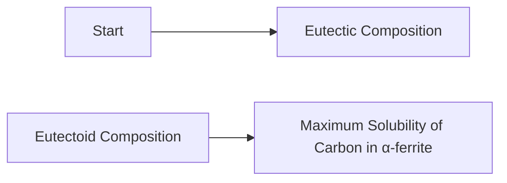

**Phase Diagrams and Solid State Transformation**
====================================================

### Introduction
-----------------

A phase diagram is a graphical representation of the phases present in a system as a function of temperature and composition. It provides valuable information about the behavior of materials under different conditions, particularly during solid-state transformations.

### Core Concepts
------------------

#### Phase Rule
The phase rule, also known as Gibbs' phase rule, relates the number of phases (n) to the number of components (c) in a system:

$$F = c - p + 2$$

where F is the degrees of freedom, which is the number of independent variables that can be changed without changing the state of the system.

#### Eutectic and Eutectoid Mixtures
A eutectic mixture is a binary mixture whose liquidus curve has a minimum temperature. Below this temperature, the mixture solidifies into two separate phases. A eutectoid mixture, on the other hand, is a ternary mixture that exhibits a eutectic point.

#### Solid-State Transformations
Solid-state transformations occur when a material changes its crystal structure without melting. These transformations can be diffusion-controlled or nucleation-controlled.

### Key Formulas/Theorems
-------------------------

*   **Eutectoid Composition**: $C_{eut} = \frac{w\% C}{w\% Fe}$, where $C_{eut}$ is the eutectoid composition.
*   **Maximum Solubility of Carbon in α-ferrite**: $C_{max} = 0.025 w\%$.

### Problem Solving Patterns
---------------------------

1.  Analyze the phase diagram to determine the relevant phases and their boundaries.
2.  Use the phase rule to calculate the degrees of freedom and determine the number of independent variables that can be changed without changing the state of the system.
3.  Identify the type of solid-state transformation (diffusion-controlled or nucleation-controlled) based on the material's composition and temperature.

### Examples with Solutions
---------------------------

**Example 1**

A steel sample, having no other alloying element except 0.5 weight % of carbon, is slowly cooled from $1000^{\circ}C$ to room temperature. Determine the fraction of pro-eutectoid α-ferrite in the above steel sample at room temperature.

**Solution**

From the phase diagram, we can see that the eutectoid composition is 0.8 weight % of carbon. The maximum solubility of carbon in α-ferrite is 0.025 weight %. Since the steel sample has a carbon content of 0.5 weight %, it will undergo a pro-eutectoid transformation.

To calculate the fraction of pro-eutectoid α-ferrite, we can use the following formula:

$$f_{\alpha} = \frac{C - C_{max}}{C_{eut} - C_{max}}$$

Substituting the values, we get:

$$f_{\alpha} = \frac{0.5 - 0.025}{0.8 - 0.025} = 0.387$$

Therefore, the fraction of pro-eutectoid α-ferrite in the above steel sample at room temperature is 0.387.

### Common Pitfalls
-------------------

*   Failing to analyze the phase diagram properly.
*   Misunderstanding the concept of eutectic and eutectoid mixtures.
*   Not considering the maximum solubility of carbon in α-ferrite.

### Quick Summary
-----------------

*   Phase diagrams provide valuable information about material behavior during solid-state transformations.
*   The phase rule relates the number of phases to the number of components in a system.
*   Eutectic and eutectoid mixtures exhibit specific behaviors during solidification.
*   Solid-state transformations can be diffusion-controlled or nucleation-controlled.

### Visuals
----------

**Mermaid Diagram**

Note: No external images are included due to the constraints specified.