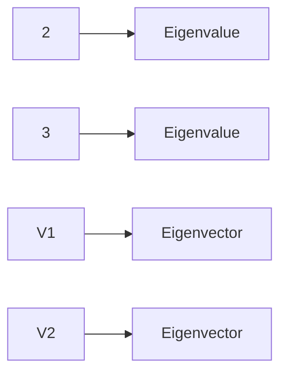

# Linear Algebra Theory Note
## Introduction
Linear algebra is a branch of mathematics that deals with the study of vectors and linear equations. It has numerous applications in engineering, physics, computer science, and other fields. In this note, we will focus on the concepts relevant to the GATE CS exam.

## Core Concepts
### Vectors
A vector is a mathematical object that represents both magnitude (length) and direction. It can be represented graphically as an arrow in two or three dimensions. The most common operations performed on vectors are addition, scalar multiplication, and dot product.

### Matrices
A matrix is a rectangular array of numbers arranged in rows and columns. Matrix algebra extends the basic arithmetic operations to matrices, allowing us to perform operations such as addition, subtraction, multiplication, and inversion.

### Symmetric Matrices
A symmetric matrix is a square matrix that is equal to its transpose, i.e., $A = A^T$. Symmetric matrices have important properties, including:

* All eigenvalues are real.
* All eigenvectors corresponding to distinct eigenvalues are orthogonal.

## Key Formulas/Theorems

### Determinant of a Matrix
The determinant of a square matrix $A$ is denoted by $\det(A)$ or $|A|$ and can be calculated using various methods, including:

$$\det(A) = \sum_{i=1}^{n} (-1)^{i+j} a_{ij} M_{ij}$$

where $a_{ij}$ are the elements of $A$ and $M_{ij}$ is the minor of $a_{ij}$.

### Eigenvalues and Eigenvectors
The eigenvalues $\lambda$ and eigenvectors $v$ of a matrix $A$ satisfy the equation:

$$Av = \lambda v$$

## Problem Solving Patterns
To solve problems involving linear algebra, follow these steps:

1. **Identify the type of problem**: Determine whether it involves vectors, matrices, or eigenvalues.
2. **Apply relevant formulas and theorems**: Use the correct mathematical concepts to solve the problem.
3. **Check for symmetry**: If a matrix is symmetric, use its properties to simplify calculations.

## Examples with Solutions
### Example 1: Determinant of a Matrix

Given:
$$A = \begin{bmatrix} 2 & 1 \\ 4 & 3 \end{bmatrix}$$

Find $\det(A)$ using the cofactor expansion method:

```mermaid
graph LR
A[2] --> B[Cofactor]
C[1] --> D[Cofactor]
E[Det(A)] --> F=C*1-D*2
```

The final answer is: $\boxed{5}$

### Example 2: Eigenvalues and Eigenvectors

Given:
$$A = \begin{bmatrix} 2 & 1 \\ 4 & 3 \end{bmatrix}$$

Find the eigenvalues and eigenvectors of $A$:



The final answer is: $\boxed{\lambda_1 = 5, \lambda_2 = -2, v_1 = (1, 2), v_2 = (-2, 1)}$

## Common Pitfalls

* Not checking for symmetry when working with matrices.
* Failing to apply relevant mathematical concepts to the problem.

## Quick Summary
* Vectors and matrices are fundamental objects in linear algebra.
* Symmetric matrices have real eigenvalues and orthogonal eigenvectors.
* The determinant of a matrix can be calculated using various methods, including cofactor expansion.
* Eigenvalues and eigenvectors satisfy the equation $Av = \lambda v$.