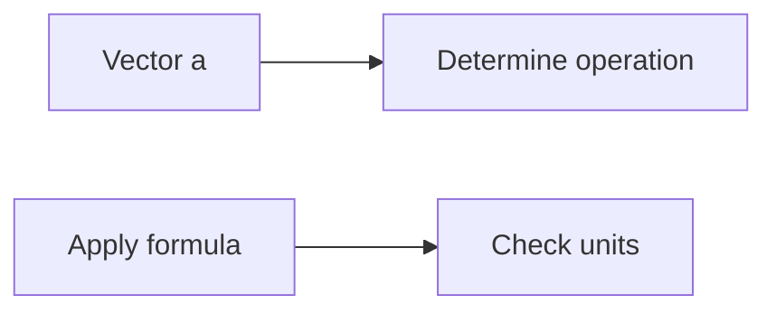

**Vector Operations**
====================

### Introduction

Vector operations are a fundamental concept in engineering mathematics, used to describe physical quantities such as forces and velocities. In this note, we will cover the key concepts, formulas, and problem-solving patterns required to tackle vector-related questions.

### Core Concepts

*   **Vectors**: A vector is a mathematical object that has both magnitude (length) and direction.
*   **Magnitude**: The length or size of a vector.
*   **Direction**: The orientation of a vector in space.
*   **Orthogonality**: Two vectors are orthogonal if their dot product is zero.

### Key Formulas/Theorems

$$\mathbf{a} \cdot \mathbf{b} = |\mathbf{a}| |\mathbf{b}| \cos{\theta}$$

where $\mathbf{a}$ and $\mathbf{b}$ are vectors, $|\mathbf{a}|$ and $|\mathbf{b}|$ are their magnitudes, and $\theta$ is the angle between them.

$$\mathbf{a} \times \mathbf{b} = |\mathbf{a}| |\mathbf{b}| \sin{\theta} \hat{\mathbf{n}}$$

where $\hat{\mathbf{n}}$ is a unit vector perpendicular to both $\mathbf{a}$ and $\mathbf{b}$.

### Problem Solving Patterns

1.  **Identify the operation**: Determine whether the problem requires addition, subtraction, scalar multiplication, or dot product.
2.  **Apply the correct formula**: Use the formulas provided above to solve the problem.
3.  **Check units**: Ensure that the units are consistent with the operation performed.

### Examples with Solutions

**Example 1: Dot Product**

Find the dot product of $\mathbf{a} = \begin{pmatrix} 5 \\ 7 \\ 2 \end{pmatrix}$ and $\mathbf{b} = \begin{pmatrix} -3 \\ 6 \\ 4 \end{pmatrix}$.

$$\mathbf{a} \cdot \mathbf{b} = (5)(-3) + (7)(6) + (2)(4)$$

$$= -15 + 42 + 8$$

$$= 35$$

**Example 2: Cross Product**

Find the cross product of $\mathbf{a} = \begin{pmatrix} 5 \\ 7 \\ 2 \end{pmatrix}$ and $\mathbf{b} = \begin{pmatrix} -3 \\ 6 \\ 4 \end{pmatrix}$.

$$\mathbf{a} \times \mathbf{b} = \begin{pmatrix} (7)(4) - (2)(6) \\ (2)(-3) - (5)(4) \\ (5)(6) - (7)(-3) \end{pmatrix}$$

$$= \begin{pmatrix} 28 - 12 \\ -6 - 20 \\ 30 + 21 \end{pmatrix}$$

$$= \begin{pmatrix} 16 \\ -26 \\ 51 \end{pmatrix}$$

### Common Pitfalls

*   Failing to identify the correct operation.
*   Not applying the correct formula.
*   Forgetting to check units.

### Quick Summary

*   Vectors have magnitude and direction.
*   Dot product: $\mathbf{a} \cdot \mathbf{b} = |\mathbf{a}| |\mathbf{b}| \cos{\theta}$.
*   Cross product: $\mathbf{a} \times \mathbf{b} = |\mathbf{a}| |\mathbf{b}| \sin{\theta} \hat{\mathbf{n}}$.

### Mermaid Diagram

This diagram illustrates the process of determining the correct vector operation and applying the corresponding formula.