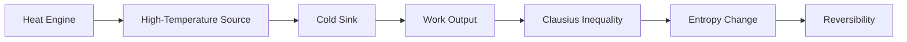

**Second Law of Thermodynamics**
=====================================

### Introduction
-----------------

The second law of thermodynamics deals with the direction of spontaneous processes and the concept of entropy. It explains why certain processes are impossible, such as building a heat engine that can convert all the heat energy put into it into useful work.

### Core Concepts
------------------

#### Entropy (S)
Entropy is a measure of disorder or randomness in a system. The total entropy of an isolated system always increases over time.

*   **Mathematical Representation:**
    \[ S = k \ln W \]
    Where:
    *   $S$ is the entropy
    *   $k$ is Boltzmann's constant ($1.38064852 \times 10^{-23} J/K$)
    *   $\ln W$ is the natural logarithm of the number of possible microstates

#### Clausius Inequality
The Clausius inequality states that for any cycle, the sum of the heat absorbed at a higher temperature divided by the absolute temperature is greater than or equal to the net work done.

*   **Mathematical Representation:**
    \[ \int \frac{\delta Q}{T} \geq 0 \]
    Where:
    *   $\delta Q$ is an infinitesimal amount of heat absorbed
    *   $T$ is the absolute temperature at which the heat is absorbed

### Key Formulas/Theorems
---------------------------

*   **Entropy Change:**
    \[ \Delta S = Q / T \]
    Where:
    *   $\Delta S$ is the change in entropy
    *   $Q$ is the amount of heat transferred
    *   $T$ is the absolute temperature

### Problem Solving Patterns
---------------------------

*   **Analyzing the Clausius Inequality:**
    To solve problems involving the Clausius inequality, focus on identifying the cycle and determining whether it's reversible or irreversible. If the process is reversible, the entropy change will be zero.
*   **Calculating Entropy Change:**
    When calculating the entropy change, ensure to use the correct formula and units.

### Examples with Solutions
---------------------------

#### Example 1:
A heat engine operates between temperatures $T_H$ and $T_C$. If it absorbs $Q_H$ amount of heat at temperature $T_H$, what is the minimum work output?

*   **Solution:**
    We can use the Clausius inequality to determine the minimum work output.
    \[ W_{min} = Q_H - T_C S \]
    Where:
    *   $W_{min}$ is the minimum work output
    *   $Q_H$ is the amount of heat absorbed at temperature $T_H$
    *   $T_C$ is the absolute temperature at which the heat is rejected
    *   $S$ is the entropy change

### Common Pitfalls
-------------------

*   **Incorrect Units:**
    Ensure to use the correct units when calculating entropy and work output.
*   **Ignoring Reversibility:**
    When analyzing the Clausius inequality, don't forget to consider whether the process is reversible or irreversible.

### Quick Summary
------------------

*   Entropy (S) measures disorder or randomness in a system.
*   The total entropy of an isolated system always increases over time.
*   The Clausius inequality states that for any cycle, the sum of the heat absorbed at a higher temperature divided by the absolute temperature is greater than or equal to the net work done.

### Mermaid Diagram

This diagram illustrates the heat engine, high-temperature source, cold sink, work output, Clausius inequality, entropy change, and reversibility.