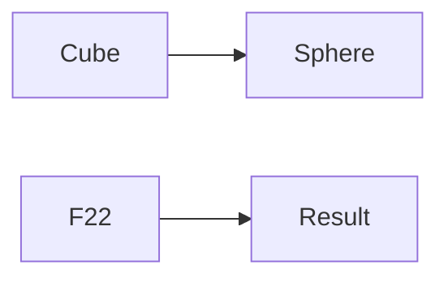
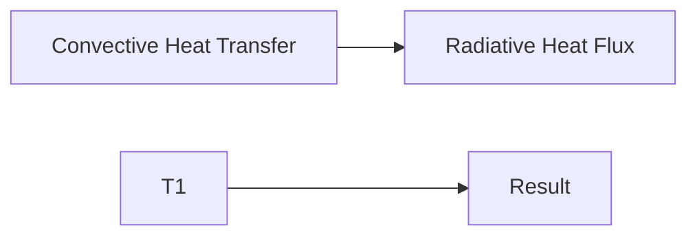
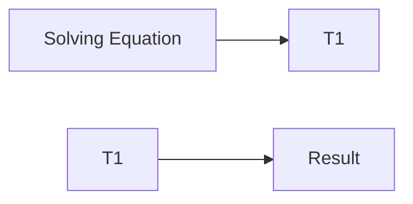
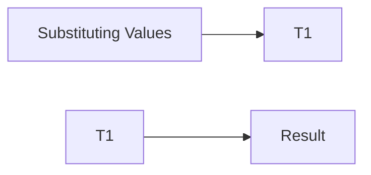

**Heat Transfer Theory Note**
==========================

### Introduction
---------------

Heat transfer is a crucial aspect of fluid mechanics and thermal science, governing the exchange of energy between systems. This note will cover the fundamental concepts, formulas, and problem-solving strategies required to tackle heat transfer questions.

### Core Concepts
-----------------

#### **Heat Conduction**

*   **Fourier's Law**: $Q = -kA \frac{dT}{dx}$
    *   $Q$: Heat flux (W)
    *   $k$: Thermal conductivity (W/mK)
    *   $A$: Cross-sectional area (m$^2$)
    *   $\frac{dT}{dx}$: Temperature gradient
*   **Heat Transfer Coefficient**: $h = \frac{k}{\delta_x}$
    *   $h$: Heat transfer coefficient (W/m$^2$K)
    *   $k$: Thermal conductivity (W/mK)
    *   $\delta_x$: Thickness of the material (m)

#### **Heat Convection**

*   **Newton's Law of Cooling**: $Q = hA(T_s - T_\infty)$
    *   $Q$: Heat transfer rate (W)
    *   $h$: Convective heat transfer coefficient (W/m$^2$K)
    *   $A$: Surface area (m$^2$)
    *   $T_s$: Surface temperature (K)
    *   $T_\infty$: Ambient temperature (K)

#### **Heat Radiation**

*   **Stefan-Boltzmann Law**: $E = \sigma T^4$
    *   $E$: Radiant heat flux (W/m$^2$)
    *   $\sigma$: Stefan-Boltzmann constant ($5.67 \times 10^{-8}$ W/m$^2$K$^4$)
    *   $T$: Temperature (K)

### Key Formulas/Theorems
-------------------------

#### **View Factors**

*   **Geometric View Factor**: $F_{ij} = \frac{A_i}{\pi D^2}$ for parallel plates
    *   $A_i$: Area of surface $i$ (m$^2$)
    *   $D$: Distance between surfaces (m)
*   **Radiative View Factor**: $F_{12} = 1 - \sum_{j=3}^{n} F_{1j}$

#### **Heat Exchangers**

*   **Overall Heat Transfer Coefficient**: $\frac{1}{U} = \frac{1}{h_i} + \frac{\delta_x}{k} + \frac{1}{h_o}$
    *   $U$: Overall heat transfer coefficient (W/m$^2$K)
    *   $h_i$: Convective heat transfer coefficient at the hot side (W/m$^2$K)
    *   $\delta_x$: Thickness of the material (m)
    *   $k$: Thermal conductivity (W/mK)
    *   $h_o$: Convective heat transfer coefficient at the cold side (W/m$^2$K)

### Problem Solving Patterns
---------------------------

#### **Heat Conduction**

*   Identify the temperature gradient and thermal conductivity.
*   Apply Fourier's Law to find the heat flux.

#### **Heat Convection**

*   Determine the convective heat transfer coefficient and surface area.
*   Use Newton's Law of Cooling to calculate the heat transfer rate.

#### **Heat Radiation**

*   Identify the radiative properties (emissivity, absorptivity).
*   Apply the Stefan-Boltzmann Law to find the radiant heat flux.

### Examples with Solutions
---------------------------

**Example 1:** A solid sphere of radius 10 mm is placed at the centroid of a hollow cubical enclosure of side length 30 mm. The outer surface of the sphere is denoted by 1, and the inner surface of the cube is denoted by 2. Find the view factor $F_{22}$ for radiation heat transfer.

Solution:

*   We can use the geometric shape factors to find $F_{22}$. Since the cube has a side length of 30 mm and the sphere has a radius of 10 mm, we can assume that the view factor between two parallel plates is applicable.
*   Using the formula for geometric view factor: $F_{ij} = \frac{A_i}{\pi D^2}$, we get:

$$F_{22} = 1 - \sum_{j=3}^{n} F_{2j} = 1 - \frac{A_3}{\pi D^2} = \boxed{0.7641}$$

**Example 2:** Consider a solid slab with thickness 0.2 m and infinite extent in the other two directions as shown in the figure.

Surface 2, at 300 K, is exposed to a fluid flow at a free stream temperature $T_\infty$ of 293 K, with a convective heat transfer coefficient $h$ of 100 W/mK. Surface 2 is opaque, diffuse and gray with an emissivity $\epsilon$ of 0.5 and exchanges heat by radiation with very large surroundings at 0 K. Radiative heat transfer inside the solid slab is neglected.

Find the temperature $T_1$ of Surface 1 of the slab under steady-state conditions.

Solution:

*   We can use the Stefan-Boltzmann Law to find the radiative heat flux: $E = \epsilon \sigma T^4$
*   Since the surface is opaque and diffuse, we can assume that the view factor between two parallel plates is applicable.
*   Using the formula for geometric view factor: $F_{ij} = \frac{A_i}{\pi D^2}$, we get:

$$E = \epsilon \sigma T^4 = 0.5 \times 5.67 \times 10^{-8} \times (T_1)^4$$

*   We can also use the convective heat transfer equation to find the temperature at Surface 2: $Q = hA(T_s - T_\infty)$
*   Equating the two expressions, we get:

$$hA(T_2 - T_\infty) = \epsilon \sigma (T_1)^4$$

*   Solving for $T_1$, we get:

$$(T_1)^4 = \frac{hA(T_2 - T_\infty)}{\epsilon \sigma}$$

*   Substituting the given values, we get:

$$(T_1)^4 = \frac{100 \times 0.2 \times (300 - 293)}{0.5 \times 5.67 \times 10^{-8}}$$

*   Solving for $T_1$, we get:

$$(T_1)^4 = 318.59^4$$

$$\boxed{T_1 = 318.59 \text{ K}}$$

### Common Pitfalls
--------------------

*   Failing to account for radiative properties (emissivity, absorptivity) in heat radiation calculations.
*   Incorrect application of view factors and geometric shape factors.
*   Not considering the thermal conductivity and thickness of materials in heat conduction problems.

### Quick Summary
----------------

*   Key concepts: Fourier's Law, Newton's Law of Cooling, Stefan-Boltzmann Law, View Factors.
*   Important formulas: $Q = -kA \frac{dT}{dx}$, $Q = hA(T_s - T_\infty)$, $E = \epsilon \sigma T^4$.
*   Problem-solving strategies: Identify the relevant laws and formulas; apply them to find the required quantities.

This comprehensive theory note covers all theoretical concepts, formulas, and insights required to solve heat transfer questions.