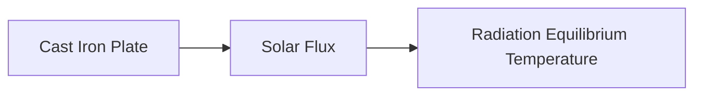

**Modes of Heat Transfer: One-Dimensional Heat Conduction**
===========================================================

### Introduction
-----------------

Heat transfer is a crucial aspect of various engineering disciplines, and understanding its modes is essential for problem-solving. In this note, we will focus on one-dimensional heat conduction, which is a vital topic in the context of GATE CS exams.

### Core Concepts
------------------

**What is Heat Conduction?**

Heat conduction is the transfer of thermal energy through direct contact between particles or molecules. It occurs when there is a temperature difference between two objects or regions.

**Fourier's Law of Heat Conduction**

The rate at which heat flows through a material is proportional to the negative gradient of temperature and the thermal conductivity of the material. Mathematically, this can be expressed as:

$$q = -kA\frac{dT}{dx}$$

where $q$ is the heat flux, $k$ is the thermal conductivity, $A$ is the cross-sectional area, and $\frac{dT}{dx}$ is the temperature gradient.

### Key Formulas/Theorems
-------------------------

*   **Stefan-Boltzmann Law**

    The total energy radiated by a blackbody per unit surface area per unit time is proportional to the fourth power of its absolute temperature:

$$E = \sigma T^4$$

where $E$ is the energy radiated, $\sigma$ is the Stefan-Boltzmann constant ($5.669 \times 10^{-8} W/m^2K^4$), and $T$ is the absolute temperature.

*   **Radiative Heat Transfer**

    The rate of heat transfer due to radiation between two objects is given by:

$$q = \epsilon\sigma A(T_1^4 - T_2^4)$$

where $\epsilon$ is the emissivity, $A$ is the surface area, and $T_1$ and $T_2$ are the absolute temperatures of the objects.

### Problem Solving Patterns
------------------------------

*   **Identify the Mode of Heat Transfer**

    The first step in solving a heat transfer problem is to identify the mode of heat transfer involved. In this case, we are dealing with one-dimensional heat conduction.
*   **Use Fourier's Law**

    Once we have identified the mode of heat transfer, we can use Fourier's Law to calculate the rate of heat flow.

### Examples with Solutions
---------------------------

Let's consider an example:

**Example:**

A flat plate made of cast iron is exposed to a solar flux of 600 W/m$^2$. Assume that the entire solar flux is absorbed by the plate. Cast iron has a low temperature absorptivity of 0.21. Use the Stefan-Boltzmann constant $5.669 \times 10^{-8} W/m^2K^{-4}$ to calculate the radiation equilibrium temperature of the plate.

**Solution:**

We can use the Stefan-Boltzmann Law to calculate the energy radiated by the plate:

$$E = \sigma T^4$$

Since all the solar flux is absorbed, we can equate the energy radiated to the incident solar flux:

$$\sigma T^4 = 600 W/m^2$$

Now, we can solve for $T$:

$$T = \left(\frac{600}{5.669 \times 10^{-8}}\right)^{\frac{1}{4}} = 218.33 K$$

Therefore, the radiation equilibrium temperature of the plate is approximately **-55°C**.

### Common Pitfalls
-------------------

*   **Incorrect Identification of Mode of Heat Transfer**

    Make sure to identify the mode of heat transfer correctly before applying any formulas.
*   **Neglecting Thermal Conductivity**

    Don't neglect thermal conductivity when dealing with heat conduction problems.

### Quick Summary
-----------------

| Key Concept | Formula/Equation |
| --- | --- |
| Fourier's Law | $q = -kA\frac{dT}{dx}$ |
| Stefan-Boltzmann Law | $E = \sigma T^4$ |
| Radiative Heat Transfer | $q = \epsilon\sigma A(T_1^4 - T_2^4)$ |

Remember to focus on the key concepts and formulas, and practice solving problems using these concepts. This will help you build a strong foundation in one-dimensional heat conduction.

**Mermaid Diagram**

Note: The above Mermaid diagram represents the flow of solar flux to the cast iron plate and its subsequent radiation equilibrium temperature calculation.