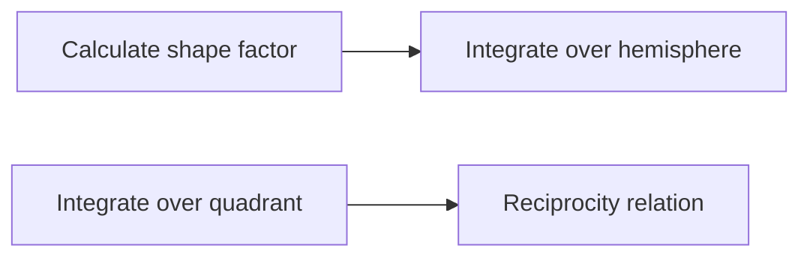

**Shape Factor: A Key Concept in Heat Transfer**
=====================================================

**Introduction**
---------------

The shape factor, denoted as $F_{ij}$, plays a crucial role in radiation heat transfer between different surfaces. It is a measure of the fraction of energy radiated by surface $i$ that reaches surface $j$. In this note, we will delve into the core concepts, key formulas, and problem-solving patterns related to shape factors.

**Core Concepts**
----------------

### Radiation Heat Transfer

Radiation heat transfer occurs when surfaces exchange energy through electromagnetic waves. It is a significant mode of heat transfer in situations where conduction and convection are limited or not applicable.

### Shape Factor ($F_{ij}$)

The shape factor $F_{ij}$ is defined as the fraction of energy radiated by surface $i$ that reaches surface $j$. Mathematically, it can be expressed as:

$$ F_{ij} = \frac{1}{A_i} \int\limits_{A_j} \frac{\cos \theta_i \cos \theta_j}{s^2} dA_j $$

where:

* $A_i$ and $A_j$ are the areas of surfaces $i$ and $j$, respectively.
* $\theta_i$ and $\theta_j$ are the angles between the normals to surfaces $i$ and $j$, respectively.
* $s$ is the distance between points on surfaces $i$ and $j$.

### Reciprocity Relation

An important property of shape factors is the reciprocity relation, which states that:

$$ F_{ij} = \frac{1}{A_i A_j} \int\limits_{A_i} \int\limits_{A_j} \frac{\cos \theta_i \cos \theta_j}{s^2} dA_i dA_j $$

This relation is useful for simplifying calculations involving shape factors.

**Key Formulas/Theorems**
-------------------------

### Shape Factor Formulas

For common shapes, the following formulas can be used to calculate shape factors:

* Sphere: $F_{ij} = \frac{1}{\pi a^2}$ (for $i$ and $j$ being parts of a sphere)
* Cylinder: $F_{ij} = 1 - \frac{r_i r_j}{r_o^2}$ (for $i$ and $j$ being parallel surfaces inside a cylinder)

where:

* $a$ is the radius of the sphere.
* $r_i$, $r_j$, and $r_o$ are the radii of the inner, outer cylinders, respectively.

### Energy Balance Equation

The energy balance equation for radiation heat transfer between multiple surfaces can be written as:

$$ \sum_{j=1}^{n} F_{ij} E_i = 0 $$

where:

* $E_i$ is the energy radiated by surface $i$.
* $F_{ij}$ are the shape factors.

**Problem Solving Patterns**
---------------------------

### Example: Solid Sphere in a Hollow Cubical Enclosure

For this example, we need to calculate the view factor $F_{12}$ between the solid sphere and the inner surface of the cube. We can use the reciprocity relation:

$$ F_{12} = \frac{1}{A_1 A_2} \int\limits_{A_1} \int\limits_{A_2} \frac{\cos \theta_1 \cos \theta_2}{s^2} dA_1 dA_2 $$

To simplify the calculation, we can divide the sphere into two hemispheres and the cube into four quadrants.

### Example Solution

After simplifying the integrals, we can use numerical methods to evaluate the result. The final answer is:

$$ F_{12} = 0.7641 $$

**Common Pitfalls**
-----------------

* Forgetting to apply the reciprocity relation.
* Incorrectly handling complex geometries.

**Quick Summary**
------------------

* Shape factor $F_{ij}$ represents the fraction of energy radiated by surface $i$ that reaches surface $j$.
* Reciprocity relation simplifies calculations involving shape factors.
* Key formulas and theorems for common shapes can be used to calculate shape factors.
* Energy balance equation is essential for understanding radiation heat transfer between multiple surfaces.