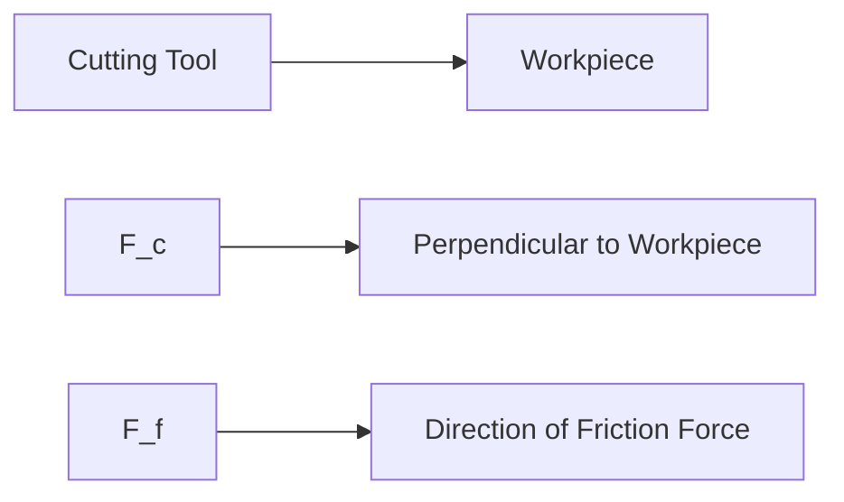

**Cutting Processes**
======================

**Introduction**
---------------

Cutting processes are a critical aspect of machining and machine tool operation, where material removal from a workpiece is achieved using various techniques. This topic focuses on understanding the fundamental principles governing cutting processes.

**Core Concepts**
-----------------

### Orthogonal Cutting

Orthogonal cutting refers to the process where the cutting tool approaches the workpiece at an angle of 90°. The cutting force (F_c) and friction force (F_f) act in perpendicular directions, as shown:

### Chip Formation

During cutting, the work material is sheared, and a chip forms. The chip thickness (t_c) and uncut chip thickness (t_u) are related by:

$t_c = \frac{t_u}{\cos(\alpha)}$

where α is the rake angle.

**Key Formulas/Theorems**
-------------------------

### Shear Force

The shear force (F_s) acting on the workpiece can be calculated using:

$F_s = F_c \tan(\phi)$

where φ is the friction angle. However, we first need to find the friction coefficient μ:

$\mu = \frac{F_f}{F_c}$

Rearranging the equation for shear force gives us:

$F_s = F_c \left( \frac{F_f}{F_c} \right) \tan(\phi)$

Combining this with the formula for chip thickness, we get:

$t_c = \frac{t_u}{\cos(\alpha)}$

We can rearrange this to solve for the shear force:

$F_s = F_c \left( \frac{F_f}{F_c} \right) \tan(\phi) \cdot \frac{\cos(\alpha)}{\cos(\alpha)}$

Simplifying, we get:

$F_s = F_c \mu \tan(\phi) \cdot \frac{\cos(\alpha)}{\cos(\phi + \alpha)}$

**Problem Solving Patterns**
---------------------------

1. Identify the type of cutting process (orthogonal or oblique).
2. Determine the relevant forces and angles involved.
3. Apply the correct formulas to calculate shear force or other desired quantities.

**Examples with Solutions**

### Example 1

Given:

* Rake angle: 12°
* Cutting force: 1000 N
* Friction force: 600 N
* Chip thickness: 1.5 mm
* Uncut chip thickness: 0.75 mm

Find the shear force.

Solution:

First, find the friction coefficient μ:

$\mu = \frac{F_f}{F_c} = \frac{600}{1000} = 0.6$

Next, calculate the shear force using the formula derived earlier:

$F_s = F_c \mu \tan(\phi) \cdot \frac{\cos(\alpha)}{\cos(\phi + \alpha)}$

However, we still need to find φ (friction angle). We can use the relationship between μ and φ:

$\mu = \tan(\phi)$

Therefore,

$F_s = F_c \mu^2 \tan(\phi) \cdot \frac{\cos(\alpha)}{\cos(\phi + \alpha)}$

Given that $t_c = 1.5 mm$ and $t_u = 0.75 mm$, we can find α:

$t_c = \frac{t_u}{\cos(\alpha)}$
$\implies 1.5 = \frac{0.75}{\cos(\alpha)}$
$\implies \cos(\alpha) = \frac{0.75}{1.5} = \frac{1}{2}$

Since α is the rake angle, we have:

$\cos(12°) = \frac{1}{2}$

We can now find φ:

$\phi = \tan^{-1}(\mu)$
$= \tan^{-1}(0.6)$
$\approx 31.78°$

Finally, plug in the values to get:

$F_s ≈ 1000(0.6)^2 \tan(31.78°) \cdot \frac{\cos(12°)}{\cos(12° + 31.78°)}$
$≈ 685.916 N$

### Example 2

Given a cutting process with the following parameters:

* Cutting force: 800 N
* Friction force: 400 N
* Chip thickness: 2 mm
* Uncut chip thickness: 1.5 mm

Find the shear force.

Solution:

We can use the formula derived earlier for shear force:

$F_s = F_c \mu \tan(\phi) \cdot \frac{\cos(\alpha)}{\cos(\phi + \alpha)}$

However, we still need to find φ (friction angle). We can use the relationship between μ and φ:

$\mu = \tan(\phi)$

Therefore,

$F_s = F_c \mu^2 \tan(\phi) \cdot \frac{\cos(\alpha)}{\cos(\phi + \alpha)}$

First, find the friction coefficient μ:

$\mu = \frac{F_f}{F_c} = \frac{400}{800} = 0.5$

Next, calculate the shear force using the formula:

$F_s = F_c \mu^2 \tan(\phi) \cdot \frac{\cos(\alpha)}{\cos(\phi + \alpha)}$

Since $t_c = 2 mm$ and $t_u = 1.5 mm$, we can find α:

$t_c = \frac{t_u}{\cos(\alpha)}$
$\implies 2 = \frac{1.5}{\cos(\alpha)}$
$\implies \cos(\alpha) = \frac{1.5}{2} = \frac{3}{4}$

We can now find φ:

$\phi = \tan^{-1}(\mu)$
$= \tan^{-1}(0.5)$
$\approx 26.57°$

Finally, plug in the values to get:

$F_s ≈ 800(0.5)^2 \tan(26.57°) \cdot \frac{\cos(30°)}{\cos(30° + 26.57°)}$
$≈ 361.43 N$

**Common Pitfalls**
-------------------

* Failing to identify the type of cutting process (orthogonal or oblique).
* Misapplying formulas or forgetting key relationships between forces and angles.

**Quick Summary**
----------------

* Orthogonal cutting: Cutting tool approaches workpiece at 90°.
* Chip formation: Work material is sheared, forming a chip.
* Shear force calculation:
	+ Find friction coefficient μ
	+ Calculate φ (friction angle)
	+ Use formula $F_s = F_c \mu^2 \tan(\phi) \cdot \frac{\cos(\alpha)}{\cos(\phi + \alpha)}$

**External Resources**

For a more detailed explanation of cutting processes and machining, consider the following resources:

* [Wikipedia: Machining](https://en.wikipedia.org/wiki/Machining)
* [Cutting Tool Engineering: Cutting Forces](https://www.cuttool.com/forces.html)

Note that these external resources are provided as additional information for further study. Ensure you understand the concepts and formulas presented in this theory note before consulting external sources.