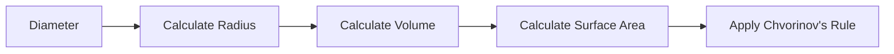

# Solidification Theory Note
=====================================

## Introduction
---------------

Solidification is a critical process in casting, where a liquid material transforms into a solid. Understanding the principles of solidification is essential for designing efficient and cost-effective casting processes. In this note, we will delve into the theoretical concepts behind solidification, including Chvorinov's rule.

## Core Concepts
-----------------

### Chvorinov's Rule

Chvorinov's rule states that the solidification time of a cast product is directly proportional to the cube of its characteristic dimension and inversely proportional to the volume of the material. Mathematically, this can be expressed as:

$$ t_{solid} \propto \frac{V}{A_s^2} $$

where $t_{solid}$ is the solidification time, $V$ is the volume of the material, and $A_s$ is the surface area of the solid.

### Characteristic Dimension

The characteristic dimension is a measure of the size of the cast product. For a rectangular prism, it can be taken as the height or any other dimension that characterizes the shape.

## Key Formulas/Theorems
-------------------------

*   Chvorinov's rule: $ t_{solid} \propto \frac{V}{A_s^2} $
*   Formula for solidification time of a rectangular prism: $t = K \left( \frac{V}{A_s^2} \right)$

## Problem Solving Patterns
---------------------------

When applying Chvorinov's rule, remember to:

1.  Calculate the volume and surface area of the cast product.
2.  Determine the characteristic dimension based on the shape of the product.
3.  Use the formula to calculate the solidification time.

### Example: Calculating Solidification Time for a Slab

Given:
*   Dimensions of the slab: $75 \, mm \times 125 \, mm \times 20 \, mm$
*   Chvorinov's index: $2$

Solution:

1.  Calculate volume: $V = l \times w \times h = 75 \, mm \times 125 \, mm \times 20 \, mm$
2.  Calculate surface area: $A_s = 2(lw + lh + wh)$
3.  Apply Chvorinov's rule: $t = K \left( \frac{V}{A_s^2} \right)$

## Examples with Solutions
---------------------------

### Example 1: Solidification Time for a Cylinder

Given:
*   Diameter of the cylinder: $50 \, mm$
*   Height of the cylinder: $50 \, mm$

Solution:

1.  Calculate radius: $r = \frac{d}{2}$
2.  Calculate volume: $V = \pi r^2 h$
3.  Calculate surface area: $A_s = 2\pi r^2 + 2\pi rh$
4.  Apply Chvorinov's rule: $t = K \left( \frac{V}{A_s^2} \right)$

## Common Pitfalls
-------------------

*   Failing to calculate the characteristic dimension correctly.
*   Not considering the shape of the cast product when applying Chvorinov's rule.
*   Incorrectly calculating volume and surface area.

## Quick Summary
-----------------

*   Chvorinov's rule states that solidification time is proportional to $\frac{V}{A_s^2}$.
*   The characteristic dimension depends on the shape of the cast product.
*   Apply Chvorinov's rule by calculating volume, surface area, and using the formula.

Note: This theory note is designed to provide a comprehensive understanding of solidification principles. However, it is essential to practice problems to apply these concepts effectively.