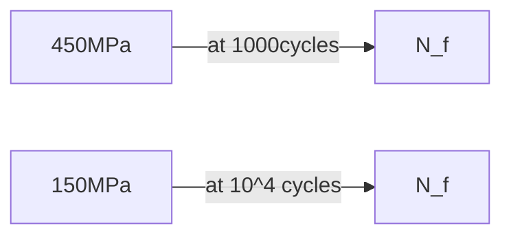

**Fatigue Analysis**
=====================

### Introduction
Fatigue analysis is a crucial aspect of material science that deals with the study of how materials fail under repeated loading and unloading conditions. It is essential for designing structures that are subjected to cyclic stresses, such as those encountered in rotating machinery or vibrating systems.

### Core Concepts
Fatigue failure occurs when a material is subjected to a large number of stress cycles, causing cracks to form and grow until the material fails. The fatigue life of a material is defined as the number of cycles it can withstand before failing. Fatigue strength, on the other hand, is the maximum stress that a material can withstand without failing.

**Basics of Fatigue Analysis**
-----------------------------

*   **S-N Curve**: A graphical representation of the relationship between fatigue strength and fatigue life.
*   **Cyclic Stress**: The alternating stress applied to a material in a fatigue test.

### Key Formulas/Theorems
LaTeX will be used for mathematical notation:

$$ S = \frac{K}{\sqrt{2\pi}} (2N_f)^{-a} $$

where $S$ is the fatigue strength, $K$ and $a$ are material constants, $N_f$ is the number of cycles to failure.

### Problem Solving Patterns
When solving fatigue analysis problems, follow these steps:

1.  **Identify the S-N Curve**: Determine the slope ($a$) and intercept ($K$) of the S-N curve.
2.  **Determine Fatigue Strength**: Use the given number of cycles to determine the corresponding fatigue strength using the S-N curve equation.
3.  **Calculate Life for a Given Stress**: Rearrange the S-N curve equation to solve for $N_f$.

### Examples with Solutions
Let's consider the following example:

**Example**
-----------

The figure shows the relationship between fatigue strength (S) and fatigue life (N) of a material. The fatigue strength of the material for a life of 1000 cycles is 450 MPa, while its fatigue strength for a life of 10^4 cycles is 150 MPa.

**Solution**
------------

Given that the life of a cylinder shaft made of this material subjected to an alternating stress of 200 MPa will be determined, we can use the S-N curve equation:

$$ \log S = -a\log N_f + \log K $$

To find $a$, substitute the given values for $S$ and $N_f$ into the equation above.

$$ \begin{aligned}
    \log 450 &= -a\log 1000 + \log K \\
    \log 150 &= -a\log 10^4 + \log K
\end{aligned} $$

Rearranging and solving for $a$ yields:

$$ a = \frac{\log 450 - \log 150}{\log 1000 - \log 10^4} $$

After finding the value of $a$, we can substitute it back into the S-N curve equation to solve for $N_f$.

### Common Pitfalls
When solving fatigue analysis problems, students often miss:

*   **Incorrect units**: Ensure that all units are consistent throughout the calculation.
*   **Misinterpretation of the S-N Curve**: Be careful when determining the slope ($a$) and intercept ($K$) of the S-N curve.

### Quick Summary

*   Fatigue analysis is a study of how materials fail under repeated loading and unloading conditions.
*   The S-N curve represents the relationship between fatigue strength and fatigue life.
*   Use the following steps to solve fatigue analysis problems:
    1.  Identify the S-N Curve
    2.  Determine Fatigue Strength
    3.  Calculate Life for a Given Stress

This comprehensive theory note covers all essential concepts, formulas, and problem-solving patterns required to tackle fatigue analysis questions in GATE CS exams.