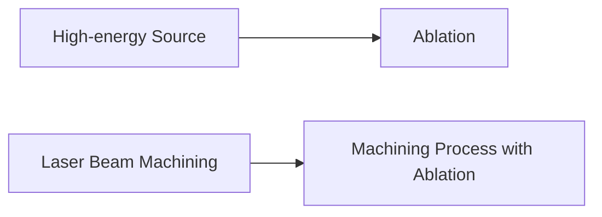

**Non-Conventional Machining Method**
=====================================

### Introduction

Non-conventional machining methods are alternative techniques used to machine materials, different from traditional cutting tools and processes. These methods often involve high-energy sources or unique principles to remove material, enabling faster and more precise processing.

### Core Concepts

1. **Ablation**: The process of removing material through the application of a high-energy source, such as heat, light, or chemicals.
2. **Abrasive Jet Machining (AJM)**: A non-traditional machining method that uses an abrasive-laden gas jet to remove material from a workpiece.
3. **Chemical Machining**: A process that uses chemical reactions to dissolve and remove material from the workpiece.

### Key Formulas/Theorems

None specific to this topic, as it focuses on understanding principles rather than mathematical formulations.

### Problem Solving Patterns

1. **Identify the energy source**: Determine if the machining method involves ablation (high-energy source) or another principle.
2. **Match the process with its characteristics**: Recognize the unique aspects of each non-conventional machining method and match them to the given description.

### Examples with Solutions

**Q1 Solution**

What is the machining process that involves ablation?

Given: The answer choice C, Laser Beam Machining, matches the concept of ablation (removal through high-energy source).

### Common Pitfalls

1. **Misidentification**: Confusing non-conventional machining methods based on superficial characteristics.
2. **Lack of understanding of the energy source**: Not recognizing the primary mechanism (e.g., ablation) behind a particular method.

### Quick Summary
- Ablation: removal through high-energy source
- AJM: abrasive-laden gas jet
- Chemical Machining: chemical reactions to dissolve material

**Note:** This summary is provided as a quick reference for revision.