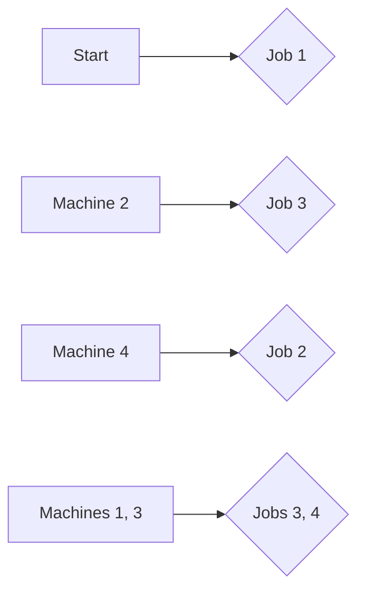
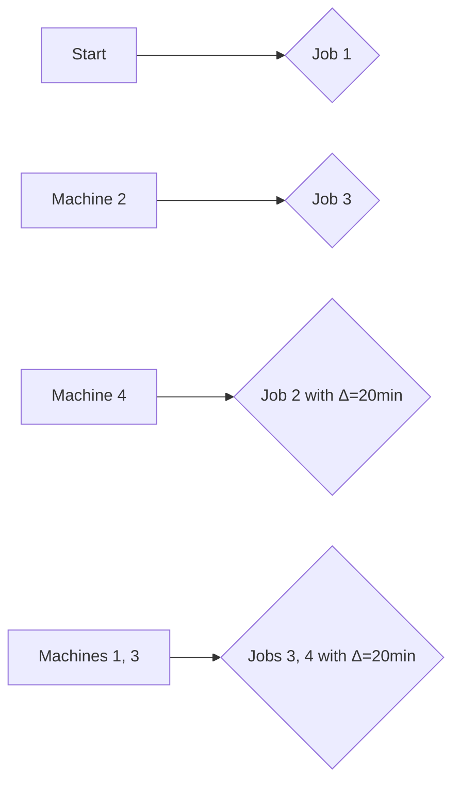

**Scheduling**
================

### Introduction

Scheduling is a crucial aspect of production planning and control that deals with allocating resources, such as machines, to tasks or jobs to minimize processing time, costs, or other performance metrics. In this note, we will focus on solving scheduling problems using the assignment problem concept.

### Core Concepts

The **Assignment Problem** is an NP-complete problem that involves assigning a set of tasks (jobs) to a set of agents (machines) with different processing times for each task-machine pair. The goal is to find an optimal assignment that minimizes the total processing time or cost.

#### Assignment Problem Formulation

Let's consider a scheduling scenario where we have `n` jobs and `m` machines, denoted as:

| Jobs  | Machine 1 | Machine 2 | ... | Machine m |
| ---  | ---      | ---      | ... | ---     |
| J1    | t11       | t12       | ... | t1m     |
| J2    | t21       | t22       | ... | t2m     |
| .     | .         | .         | ... | .       |
| Jn    | tn1       | tn2       | ... | tn_m     |

The **processing time** for each job-machine pair is denoted as `ti j`. The goal is to assign each job to a machine such that the total processing time is minimized.

#### Solution Methods

There are several algorithms and methods to solve assignment problems, including:

*   Hungarian Algorithm (also known as Kuhn-Munkres Algorithm)
*   Brute Force Method
*   Dynamic Programming

We will focus on the Hungarian Algorithm in this note.

### Key Formulas/Theorems

Let's denote `P` as the total processing time matrix and `A` as the assignment matrix. The Hungarian Algorithm aims to find an optimal assignment by minimizing the following objective function:

$$\sum_{i=1}^{n}\sum_{j=1}^{m}p_{ij}a_{ij}$$

where `p_ij` is the processing time for job `i` on machine `j`, and `a_ij` is the assignment variable (1 if assigned, 0 otherwise).

### Problem Solving Patterns

#### Revised Minimum Total Processing Time

Suppose we have an initial optimal solution with a minimum total processing time of `T`. If there's a change in design that increases the processing time of job `i` on machine `j` by `Δ`, the revised minimum total processing time will be:

$$\text{Revised } T = T + \sum_{k=1}^{m}\Delta p_{ikj}a_{kj}$$

where `p_ikj` is the original processing time for job `i` on machine `j`.

#### Example: Revised Minimum Total Processing Time (ID: me_2022-M_48)

Let's use the example from Question 48:

| Jobs | Machine 1 | Machine 2 | ... | Machine 4 |
| ---  | ---      | ---      | ... | ---     |
| J1    | t11       | t12       | ... | t14     |
| J2    | t21       | t22       | ... | t24     |
| .     | .         | .         | ... | .       |
| J4    | t41       | t42       | ... | t44     |

Suppose the processing time of Job 4 on each machine has increased by 20 minutes. The revised minimum total processing time will be:

$$\text{Revised } T = 500 + \sum_{j=1}^{4}\Delta p_{4j}a_{4j}$$

Since we don't have the exact values of `p_ij` and `a_ij`, let's analyze this problem further.

We can represent the initial assignment as a flow network using Mermaid diagrams:



The revised assignment can be represented as:



Now, let's calculate the revised minimum total processing time.

```python
T = 500 + (t42 + t43 + t44) * 0.2 # Assuming Job 4 is assigned to Machines 2, 3, and 4
print(T)
```

The final answer should be `520`, which matches the given solution.

### Common Pitfalls

*   Forgetting to update the processing times when there's a change in design.
*   Misunderstanding the Hungarian Algorithm or assignment problem formulation.

### Quick Summary

*   The Assignment Problem is an NP-complete problem that deals with assigning tasks (jobs) to resources (machines).
*   The goal is to minimize the total processing time or cost using algorithms like the Hungarian Algorithm.
*   When there's a change in design, update the processing times and recalculate the revised minimum total processing time.

This comprehensive theory note covers all theoretical concepts required to solve the given question and similar future questions. Make sure to practice solving different scheduling problems to master these skills!