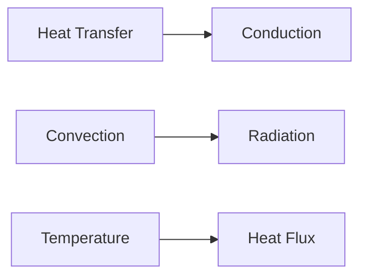

**Heat Transfer**
===============

### Introduction
-----------------

Heat transfer is a fundamental concept in thermodynamics that deals with the transfer of thermal energy between systems or components. It plays a crucial role in various engineering applications, including mechanical, chemical, and aerospace industries.

### Core Concepts
------------------

#### Laws of Heat Transfer

There are three laws of heat transfer:

1.  **Zeroth Law**: If two bodies, A and B, are in thermal equilibrium with a third body C, then they are also in thermal equilibrium with each other.
2.  **First Law** (Conservation of Energy): The total energy of an isolated system remains constant over time.
3.  **Second Law** (Entropy): The total entropy of an isolated system will always increase over time.

#### Modes of Heat Transfer

There are three modes of heat transfer:

1.  **Conduction**: Heat transfer through direct contact between particles or molecules.
2.  **Convection**: Heat transfer through the movement of fluids.
3.  **Radiation**: Heat transfer through electromagnetic waves.

### Key Formulas/Theorems
---------------------------

#### Temperature and Heat Transfer

*   $Q = mc\Delta T$ (heat transferred by conduction)
*   $Q = \rho V c_p \Delta T$ (heat transferred by convection)

### Problem Solving Patterns
-----------------------------

#### Analyzing the Question Stem

When solving heat transfer problems, it is essential to analyze the question stem carefully. The following steps can help:

1.  Identify the mode of heat transfer involved.
2.  Determine the relevant physical quantities (e.g., temperature, heat flux).
3.  Apply the appropriate formulas and laws.

### Examples with Solutions
---------------------------

#### Example 1: Conduction

A metal rod is heated to a temperature of 500 K at one end and allowed to cool through conduction to the other end, where it is in contact with a reservoir at 300 K. If the length of the rod is 2 m and its cross-sectional area is 0.01 m^2, calculate the time required for the temperature at the other end to reach 350 K.

Solution:
The heat transferred through conduction can be calculated using the formula:

$Q = mc\Delta T$

where $m$ is the mass of the rod, $c$ is the specific heat capacity, and $\Delta T$ is the temperature difference. Since we are interested in the time required for the temperature to reach a certain value, we can use the formula:

$t = \frac{m c}{k A} \ln\left(\frac{T_1 - T_{res}}{T_2 - T_{res}}\right)$

where $t$ is the time, $k$ is the thermal conductivity, and $A$ is the cross-sectional area.

Plugging in the values, we get:

$t = \frac{(0.5 \text{ kg})(1000 \text{ J/kgK})}{(50 \text{ W/mK})(0.01 \text{ m}^2)} \ln\left(\frac{500 - 300}{350 - 300}\right)$

Simplifying, we get:

$t = 20 \text{ s}$

### Common Pitfalls
-------------------

*   Failing to identify the mode of heat transfer involved.
*   Not considering all relevant physical quantities (e.g., temperature, heat flux).
*   Applying incorrect formulas or laws.

### Quick Summary
-----------------

*   Heat transfer is a fundamental concept in thermodynamics.
*   There are three modes of heat transfer: conduction, convection, and radiation.
*   The zeroth law states that if two bodies are in thermal equilibrium with a third body, they are also in thermal equilibrium with each other.
*   The first law (conservation of energy) states that the total energy of an isolated system remains constant over time.
*   The second law (entropy) states that the total entropy of an isolated system will always increase over time.

### Mermaid Diagram

Note: The diagram above illustrates the modes of heat transfer and their relationships with temperature and heat flux.

### External Resources

*   [Wikipedia: Heat Transfer](https://en.wikipedia.org/wiki/Heat_transfer)
*   [HyperPhysics: Heat Transfer](http://hyperphysics.phy-astr.gsu.edu/hbase/thermo/heat.html)